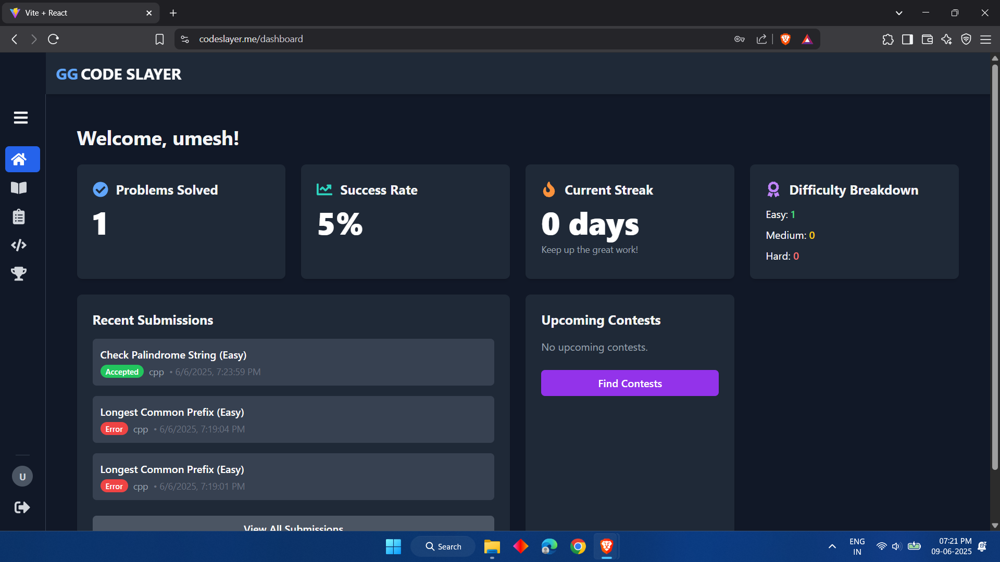

# Code_Slayer

**Code_Slayer** is a full-stack coding platform inspired by sites like LeetCode and HackerRank. It provides a modern online environment for coding practice, problem-solving, and code compilation. The platform features JWT-based authentication, a sleek and responsive UI, and a real-time code editor and compiler.

---

## 🚀 Features

- **User Authentication**: Secure JWT-based user login and signup.
- **Online Editor**: Write and run code directly in your browser.
- **Code Compilation**: Supports real-time code compilation and execution.
- **Responsive UI**: Mobile-friendly, fast, and visually appealing interface.
- **Problem Management**: Add, edit, and track coding challenges.
- **User Profiles**: Save progress and view submission history.
- **Dockerized Deployment**: Easy to run anywhere.
- **Cloud Deployments**: Out-of-the-box support for GitHub Pages, AWS EC2/ECR, Render, and Vercel.
- **Environment Variables**: Securely manage API keys and configuration.

---

## 🌐 Live Site

Check out the platform live at: [https://codeslayer.me](https://codeslayer.me)

---

## 🏛️ System Architecture

```
                    +----------------------+
                    |      MongoDB         |
                    |     (Database)       |
                    +----------+-----------+
                               |
                               v
    +---------+        +-------+-------+       +---------------------------+
    | Vercel  +------->|   Server      |<----->|  Compiler Backend         |
    |Frontend |        |   (Render)    |       |   (EC2 + ECR)            |
    +---------+        +-------+-------+       +---------------------------+
                               |
                               v
                       +---------------+
                       |    Gemini      |
                       | (AI Review API)|
                       +---------------+
```

- **Main Backend:** Hosted on Render
- **Frontend:** Hosted on Vercel
- **Compiler Backend:** Runs on EC2 using Docker image from ECR
- **Database:** MongoDB
- **AI Review:** Gemini API

---

## 📸 Screenshots

### Landing Page


### Problem List


### Problem Page


### Dashboard


### Profile Page


### Submission List


## 🗂️ Project Structure

```
Code_Slayer/
├── backend/                  # Backend API server (Node.js/Express, MongoDB)
│   ├── controllers/          # Logic for handling API requests
│   ├── middleware/           # Express middleware functions (auth, rate limiting, etc.)
│   ├── models/               # Database schemas (Mongoose models)
│   ├── routes/               # API route definitions
│   ├── utils/                # Helper/utility functions
│   ├── app.js                # Express app configuration
│   ├── server.js             # Backend server entry point
│   ├── Dockerfile            # Dockerfile for backend containerization
│   └── package.json
│
├── compiler_backend/         # Code compilation/execution microservice (Node.js/Express)
│   ├── controllers/          # Logic for handling code execution requests
│   ├── routes/               # API routes for code execution/judging
│   ├── utils/                # Utility functions for code execution/sandboxing
│   ├── app.js                # Express app configuration
│   ├── server.js             # Compiler backend server entry point
│   ├── Dockerfile            # Dockerfile for compiler backend containerization
│   └── package.json
│
├── frontend/                 # Frontend client (React + Vite + Tailwind CSS)
│   ├── public/               # Static assets (favicon, images, etc.)
│   ├── src/
│   │   ├── components/       # Reusable React components
│   │   ├── pages/            # Page components for each route/view
│   │   ├── App.jsx           # Main App component
│   │   └── main.jsx          # App entry point
│   ├── tailwind.config.js    # Tailwind CSS configuration
│   └── package.json
│
├── README.md
└── LICENSE
```

---

## 🛠️ Tech Stack

### Frontend

- [React](https://react.dev/) + [Vite](https://vitejs.dev/)
- [Tailwind CSS](https://tailwindcss.com/)
- [Monaco Editor](https://microsoft.github.io/monaco-editor/) (for code editing)
- [Axios](https://axios-http.com/) (for API requests)
- [React Router](https://reactrouter.com/) (for routing)

### Backend

- [Node.js](https://nodejs.org/) (v20+)
- [Express](https://expressjs.com/)
- [jsonwebtoken](https://github.com/auth0/node-jsonwebtoken) (JWT Auth)
- [Mongoose](https://mongoosejs.com/) (MongoDB ODM)
- [CORS, dotenv, bcrypt]

### Database

- [MongoDB Atlas](https://www.mongodb.com/atlas) (cloud)

### DevOps / Deployment

- [AWS EC2/ECR](https://aws.amazon.com/ec2/), [Docker](https://www.docker.com/) (service containerization)
- [Render](https://render.com/)
- [Vercel](https://vercel.com/)

---

## ⚡ Prerequisites

- [Node.js](https://nodejs.org/) (v20+ recommended)
- [npm](https://www.npmjs.com/) or [yarn](https://yarnpkg.com/)
- [MongoDB Atlas](https://www.mongodb.com/atlas) account or [MongoDB Compass](https://www.mongodb.com/products/compass) for local development
- [Docker](https://www.docker.com/) for containerized deployments
- For code execution (Required for the compiler_backend to execute C++ and Python code):
  - **C++ Compiler** (e.g., g++): Required if supporting C++ code execution
  - **Python 3.x**: Required if supporting Python code execution

---

## 🏁 Getting Started

### 1. Clone the repository

```bash
git clone https://github.com/55247719/Code_Slayer.git
cd Code_Slayer
```

### 2. Install dependencies

For each component, run:
```bash
cd frontend
npm install

cd ../backend
npm install

cd ../compiler_backend
npm install
```

### 3. Environment Variables

Copy the `.env.example` file to `.env` in your `backend`, `compiler_backend`, and `frontend` folders and fill in your API keys and secrets.

**Example `.env` for frontend:**
```
VITE_API_BASE_URL=your_vite_api_base_url
```

**Example `.env` for backend:**
```
PORT=your_port
MONGO_URI=your_mongo_url
JWT_SECRET=your_jwt_secret
GMAIL_USER=your_email
GMAIL_PASS=your_email_password
GOOGLE_API_KEY=your_api_key    # For AI code review
FRONTEND_URL=your_frontend_url
COMPILER_BACKEND_URL=your_compiler_backend_url
EMAIL_VALIDATION_API=your_email_api_key    # For email verification service
```

**Example `.env` for compiler_backend:**
```
COMPILER_BACKEND_PORT=your_compiler_backend_port
```

### 4. Start the servers

#### Backend
```bash
cd backend
npm start
```

#### Compiler Backend

**Make sure you have required compilers/interpreters installed (g++, python3, etc.) on your machine.**

```bash
cd compiler_backend
npm install
# Make sure g++ and python3 are available in PATH for code execution support.
npm start
```

#### Frontend
```bash
cd frontend
npm run dev
```

---

## 🌐 Deployment

- **Frontend**: Can be deployed to GitHub Pages or Vercel for static hosting.
- **Backend/Compiler**: Deploy to AWS EC2, Render, or any Docker-compatible host.

### Docker

You can build and run each backend service individually using their respective `Dockerfile`.

#### Backend

```bash
cd backend
docker build -t code_slayer_backend .
docker run -p <your_backend_port>:<your_backend_port> --env-file .env code_slayer_backend
```

#### Compiler Backend

```bash
cd compiler_backend
docker build -t code_slayer_compiler_backend .
docker run -p <your_compiler_backend_port>:<your_compiler_backend_port> --env-file .env code_slayer_compiler_backend
```

> Remember to update the ports and environment variables as needed.

---

## 📚 API Endpoints

A summary of available API endpoints (all routes are prefixed with `/api/`):

### Auth (`/api/auth`)
- `POST /register` – Register a new user
- `POST /login` – Log in and receive JWT
- `POST /verification` – Verify OTP/code for user
- `POST /resend-code` – Resend verification code/OTP
- `POST /forgot-password` – Initiate password reset
- `POST /reset-password` – Reset password with token

### User (`/api/user`)
- `GET /profile` – Get user profile

### Dashboard (`/api/dashboard`)
- `GET /:userId` – Get dashboard data for a user (JWT required)

### Problems (`/api/problem`)
- `GET /` – Get all problems (JWT required)
- `GET /tags` – Get all tags (JWT required)
- `GET /:id` – Get problem by ID (JWT required)
- `POST /` – Create a new problem (Admin only)
- `PUT /:id` – Update a problem (Admin only)
- `DELETE /:id` – Delete a problem (Admin only)

### Compiler (`/api/compiler`)
- `POST /run` – Run code (JWT required)
- `POST /test` – Test code against all test cases (JWT required)

### Submissions (`/api/submission`)
- `POST /` – Submit code for a problem (JWT required)
- `GET /user/:userId` – Get user submissions (JWT required)

### AI (`/api/ai`)
- `POST /review` – AI-powered code review (JWT required)

### Compiler Backend (Internal MicroService)
- `POST /execute` – Run code (used for "Run Code")
- `POST /judge` – Judge code against all test cases

---

## 🚧 Future Enhancements

- **Gamification**:  
  Add badges, achievements, XP points, duel System and more exciting features.

- **Contests**:  
  Host timed coding contests and hackathons with leaderboards and prizes.

- **Leaderboard**:  
  Global and weekly leaderboards to showcase top performers.

- **Discussion Forum**:  
  Enable users to discuss problems, share approaches, and ask for help.

- **Multi-language Support**:  
  Allow code submission and compilation in more languages (e.g., Java, JavaScript, Go, etc).

- **Integrations**:  
  OAuth login (Google, GitHub), notifications via email or Discord/Slack.

---

## 📄 License

MIT License

---

> _Happy Coding!_ 👨‍💻🚀
